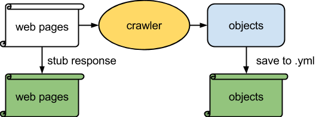
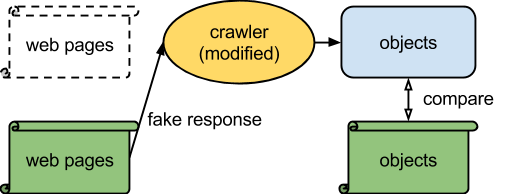
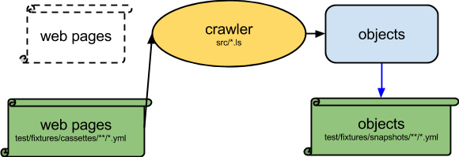
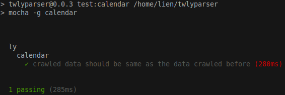

twlyparser
============

[](https://gemnasium.com/g0v/twlyparser)

WARNING: this is work in progress and the file format is likely to change!

# Prepare environment

The files with .ls extension is a LiveScript source file. 
LiveScript is a language which compiles to JavaScript.

For emacs user, please use
https://github.com/YHisamatsu/livescript-mode for syntax highlight.

## To install node.js and npm and LiveScript in Ubunutu

The node.js in Ubuntu is pretty old and does not work with
LiveScript. Please use the one in chris ppa.

```
$ sudo add-apt-repository ppa:chris-lea/node.js
$ sudo apt-get update
$ sudo apt-get install nodejs npm
```

and some dependency

    $ sudo aptitude install libcups libimage-size-perl

## install required node.js packages

```
$ npm i

## compile 
$ npm run prepublish
```

# Parsing from prepared text version of gazettes:

```
# get ly-gazette in the same directory with twlyparser
$ cd ..
$ git clone git://github.com/g0v/ly-gazette.git

# output/raw/4004.text -> output/raw/4004.md
$ cd twlyparser
$ ./node_modules/.bin/lsc ./format-log.ls --fromtext --gazette 4004 --dir ./output/raw

# generate all gazettes for 8th AD
$ ./node_modules/.bin/lsc ./format-log.ls --fromtext --ad 8 --dir ./output/raw
```

# Parsing from official source

To retrieve source word files of a specific gazette that is already listed in
'data/index.json':

```
$ ./node_modules/.bin/lsc get-source.ls --gazette 4004

```

Convert to html with 'unoconv':

You'll need to install LibreOffice.

```
# make sure you do `git submodule init` and `git submodule update`
$ ./node_modules/.bin/lsc populate-sitting.ls --force --gazette 4004
```

# To parse:

you may use the sample data to skip `get-source` and unoconv conversion

twlyrawdata.tgz : download from http://dl.dropbox.com/u/30657009/ly/4004.tgz

```
$ mkdir source/
$ tar xzvf twlyrawdata.tgz -C source/ 
$ mkdir output

# convert doc files to html and update data/gazettes.json with metadata
$ ./node_modules/.bin/lsc populate-sitting.ls --dometa

# generate text file from source/
$ ./node_modules/.bin/lsc ./format-log.ls --text --gazette 4004 --dir ./output

# generate markdown file from text generated above
$ ./node_modules/.bin/lsc ./format-log.ls --fromtext --gazette 4004 --dir ./output

# generate all gazettes for 8th AD
$ ./node_modules/.bin/lsc ./format-log.ls --text --ad 8 --dir ./output
$ ./node_modules/.bin/lsc ./format-log.ls --fromtext --ad 8 --dir ./output
```

# To generate json files from md

```
# generate specific gazette or AD
$ ./node_modules/.bin/lsc ./md2json.ls --gazette 4004 --dir ./output
$ ./node_modules/.bin/lsc ./md2json.ls --ad 8 --dir ./output

# generate all gazettes
$ ./node_modules/.bin/lsc ./md2json.ls --dir ../data
```

# To generate json files of gazettes (only supports interpellation for now)

```
./node_modules/.bin/lsc format-log-resource-json.ls --dir ../data
```

# generate CK csv from json
```
./node_modules/.bin/lsc ck_json2csv_mly.ls > mly.csv                 # ./data/mly-8.json
./node_modules/.bin/lsc ck_json2csv_gazette.ls > gazettes.csv        # ./data/gazettes.json
./node_modules/.bin/lsc ck_json2csv_vote.ls --dir ../ly-gazette/raw  # 3110.json 3111.json ...
```

# To bootstrap or maintain the index file cache in data/:

```
mkdir -p source/meta
sh ./list 4004 > source/meta/4004.html
./node_modules/.bin/lsc ./parse-list.ls source/meta/*.html
./node_modules/.bin/lsc ./prepare-source.ls
```

data/index.json should now be populated.

# Parse ly.gov.tw flow

There are some pages of gov.tw that we can query data. such as

1. http://misq.ly.gov.tw/
1. lis.ly.gov.tw - but you cannot use this link directly for some technical reasons
    1. go to http://npl.ly.gov.tw/do/www/homePage
    1. choose '立法院議事系統'

## misq

There is a script to generate bill-diff. But we need the billId of a bill to bootstrap the script. The billId could be found in misq page. use *1010509070300300* as a billId for example

    ./node_modules/.bin/lsc parse-bill.ls 1010509070300300

could helps us to generate bill-diff. It might fiailed in first run, just execute it twice.

## tts

We can parse motion data from lis.ly.gov.tw as well. First of all, install chrome extension  from g0v/ly-crx, then

    1. open lis.ly.gov.tw (in correct way)
    1. query motion
    1. You will see 'download all' in the page of query result, click the button
    1. The browser will open a new page, save the whole content of opened page to /tmp/foo.html

    ./node_modules/.bin/lsc parse-tts.ls /tmp/foo.html > foo.json

## Summary

    ./node_modules/.bin/lsc populate-summary.ls

## parse.py

to parse ly-law-record and ly-statistics

```
init_statistics(to_path)
init_record(to_path)
update_record(json_path, output_path)
```

All path without specificate (e.g. to_path, output_path), don't put on file type 

  * init_record('../ly-record/record')

  * update_record('../ly-record/record.json', '../ly-record/record')

All function will generate csv and json file

# API

*   get-calendar-by-year(*year*, *seen*) => entries

    Crawl calendar from `ly.gov.tw`

# Test

## Arichtecture

1.  Stub response and save to .yml

    

2.  Replay fake response and compare

    

## Workflow

1.  Run **npm run shot:*something*.**

    Shot both cassettes and snapshots by using network

    

    or shot only snapshots by using the cassettes

    

2.  Run **npm run test:*something*.**

    

## Shot fixtures for test

*   Calendar

        $ npm run shot:calendar

If you don't has any cassettes under `test/fixtures/cassettes/something/*.yml`,
it will shot both cassettes and snapshots by using network.


If you already had,
it will shot only snapshots by using the cassettes: `test/fixtures/cassettes/something/*.yml`.


## Run test

*   Run all test

        $ npm run test

*   Run specific test

    *   Calendar

            $ npm run test:calendar

        

# CC0 1.0 Universal

To the extent possible under law, Chia-liang Kao has waived all copyright
and related or neighboring rights to twlyparser.

This work is published from Taiwan.

http://creativecommons.org/publicdomain/zero/1.0
